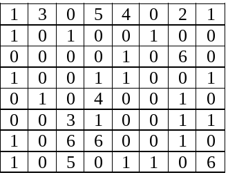
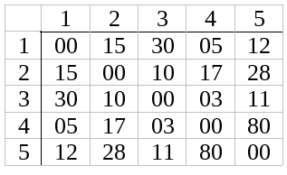

# Básico

* Fazer um programa para receber um número inteiro de segundos do usuário e imprimir a quantidade correspondente em horas, minutos e segundos.
* Fazer um programa para receber 3 valores inteiros do usuário e mostrar a sua média (que pode não ser inteira).

# Estruturas condicionais

* Fazer um programa para ler um número do usuário e determinar se este número é par ou não par.

* Fazer um programa  para receber valores inteiros X, Y e Z do usuário e determinar se estes valores podem formar os lados de um triângulo. Em caso afirmativo, informar se o triângulo é eqüilátero, isósceles ou escaleno.

* Fazer um programa que recebe um símbolo de operação do usuário (+, -, / ou *) e dois números reais. O programa deve retornar o resultado da operação recebida sobre estes dois números.

# Estruturas de repetição

* O número 3025 possui a seguinte característica: 30 + 25 = 55   -> 55*55 = 3025. Fazer um programa para obter todos os números de 4 algarismos com a mesma característica do número 3025.

* Fazer um programa para mostrar os 100 primeiros termos da série de Fibonacci.

* Um método para calcular raiz aproximada:

   1. Comece testando um *g* qualquer
   2. Se *g\*g* está perto suficientemente de *x*, 
     1. então *g* é uma boa aproximação da raiz quadrada de *x*. Fim do algoritmo.
     2. Senão crie uma novo g que é a média g e *x/g*, Ou seja,  *g = (g + x / g) / 2*
     3. Com o novo *g*, volte ao passo *2*.
    
* Faça um programa que calcule e escreva o valor de S

* Faça um programa que leia um valor N inteiro e positivo, calcule o mostre o valor E, conforme a fórmula a seguir

* Uma das maneiras de se conseguir a raiz quadrada de um número é subtrair do número os ímpares consecutivos a partir de 1, até que o resultado da subtração seja menor ou igual a zero. O número de vezes que se conseguir fazer a subtração é a raiz quadrada exata (resultado 0) ou aproximada do número (resultado negativo). Ex.: Raiz de 16,  16-1 = 15-3 = 12-5 = 7-7 = 0
 
* Fazer um programa para receber dois números do usuário e calcular o seu MDC utilizando o método de Euclides. O programa deve continuar pedindo dois números até que 0 e 0 sejam fornecidos.

* Fazer um programa para encontrar todos os pares de números amigáveis entre 1 e 100000. Um par de números é amigável quando cada um deles é igual à soma dos divisores do outro.

* Faça um programa que sorteie um número aleatório entre 0 e 500 e pergunte ao usuário qual é o "número mágico". O programa deverá indicar se a tentativa efetuada pelo usuário é maior ou menor que o número mágico e contar o número de tentativas. Quando o usuário conseguir acertar o número o programa deverá classificar o usuário como: 
    a. De 1 a 3 tentativas: muito sortudo
    b. De 4 a 6 tentativas: sortudo
    c. De 7 a 10 tentativas: normal
    d. > 10 tentativas: tente novamente
    
 # Vetores (ou arrays)
 
* Faça um programa que lê um dado N valores, guarde em um vetor e imprima:	
    a. maior valor
    b. média dos valores
    c. os valores dispostos em ordem crescente
    d. sub conjunto de valores primos que está contido no vetor
    
 * Faça um programa que, dados dois vetores bidimensionais (matrizes A e B) com dimensões de no máximo 5x5 elementos, retorne:
        a. a soma destas duas matrizes
        b. a soma das diagonais de cada matriz
        c. a multiplicação das duas matrizes
        
* Vamos supor que várias pedras do jogo de xadrez estão no tabuleiro. Para facilitar a indicação das peças, vamos convencionar:
1 – peões	3 – torres	5 – reis		0 – ausência de peças
2 – cavalos	4 – bispos	6 – rainhas

* O tabuleiro é o seguinte:

a) Construa um programa que determine a soma total entre peões ou bispos e a quantidade de posições com ausência de peças;
b) Escreva outro programa que determine qual a quantidade de cada tipo de peça no tabuleiro.

* A distância entre várias cidades é dada pela tabela abaixo (em km):

a) Construa um programa que leia a tabela acima e informe ao usuário a distância entre duas cidades por ele requisitadas, até que ele entre com o código 0 para ambas as cidades;
b) Elabore um programa que imprima a tabela sem repetições, isto é, se a distância entre as cidades 1 e 3 foi emitida, não é necessário emitir a distância entre 3 e 1;
c) Dado um determinado percurso, imprima o total percorrido:
Exemplo: dado o percurso 1, 2, 3, 2, 5, 1, 4, teremos:
15 + 10 + 10 + 28 + 12 + 5 = 80 km.

* Um cinema que possui capacidade de 20 lugares está sempre lotado. Certo dia cada espectador respondeu a um questionário, onde constava:
	- sua idade;
	- sua opinião em relação ao filme, que podia ser: ótimo, bom, regular, ruim ou péssimo.

* Elabore um programa que, recebendo estes dados calcule e mostre:

    a. a quantidade de respostas ótimo;
    b. a diferença percentual entre respostas bom e regular;
    c. a média de idade das pessoas que responderam ruim;
    d. a porcentagem de respostas péssimo e a maior idade que utilizou esta opção;
    e. a diferença de idade entre a maior idade que respondeu ótimo e a maior idade que respondeu ruim.
